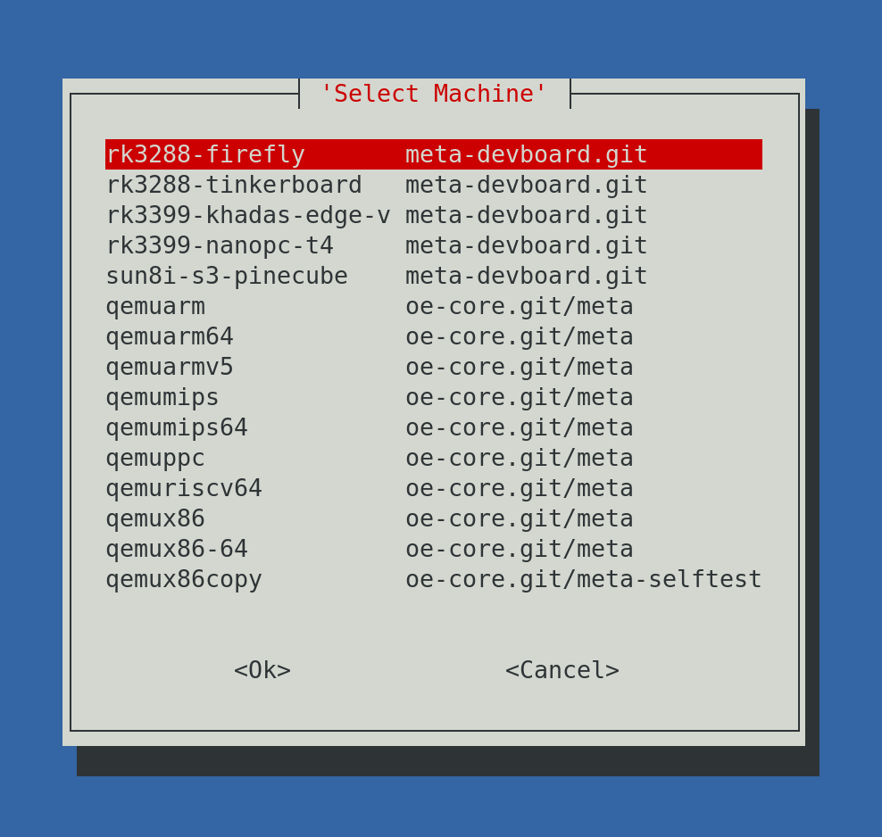
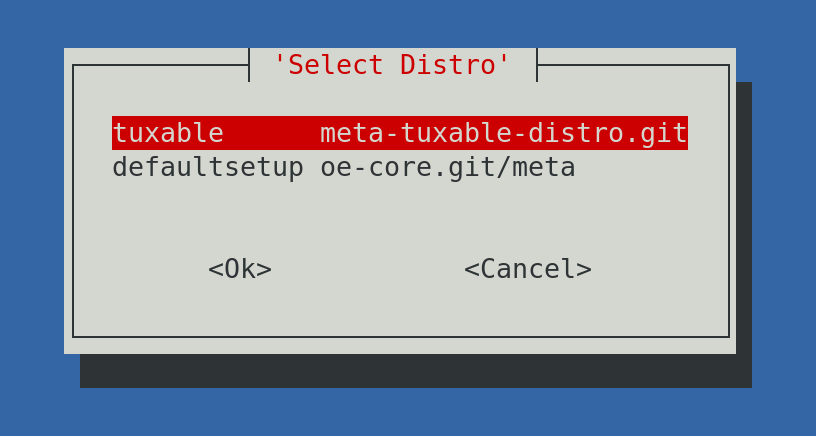

# Tuxable Linux

An [OpenEmbedded](http://www.openembedded.org/) based distribution setup for easy testing of common development boards through the [meta-devboard](https://github.com/tuxable-ltd/meta-devboard) BSP layer which leverages mainline Linux kernel builds from [meta-linux-mainline](https://gitlab.com/openembedded/community/meta-linux-mainline). This repository is a git submodules setup which allows easy checkout of all the required layers in order to build the distribution for the board of your choice.

# Goals

Tuxable Linux is designed to be a reference distribution supporting a variety of common System on Chip development board vendors running on a mainline Linux kernel build with a focus on simplicity and correctness in it's use of the OpenEmbedded ecosystem.

# Building

In order to build Tuxable Linux on your local machine please follow the instructions below:

```
git clone https://github.com/tuxable-ltd/tuxable-oe-submodules.git
cd tuxable-oe-submodules
git submodule update --init --recursive -j 4
./setup-new-build
```

At this point you will be asked to select your chosen development board and which OpenEmbedded distro you wish to use.





Once selected the script will then go onto setting up your local build. An example of the output looks like:

```
[jack@arch-corsair tuxable-linux]$ ./setup-new-build 
INFO: Selected machine: rk3288-firefly
INFO: Selected distro: tuxable
INFO: Selected build dir: /mnt/scratch/tuxable-linux/builds/build-rk3288-firefly
INFO: Selected download dir: /mnt/scratch/tuxable-linux/builds/downloads
INFO: Selected shared state dir: /mnt/scratch/tuxable-linux/builds/sstate
INFO: Generated setup script
Loading cache: 100% |                                                                                 | ETA:  --:--:--
Loaded 0 entries from dependency cache.
Parsing recipes: 100% |################################################################################| Time: 0:00:04
Parsing of 806 .bb files complete (0 cached, 806 parsed). 1420 targets, 76 skipped, 0 masked, 0 errors.
INFO: Adding layers, this may take a while...
INFO: Added layer /mnt/scratch/tuxable-linux/openembedded/meta-kernel.git sucessfully
INFO: Added layer /mnt/scratch/tuxable-linux/openembedded/meta-tuxable-distro.git sucessfully
INFO: Added layer /mnt/scratch/tuxable-linux/openembedded/meta-devboard.git sucessfully
INFO: Added layer /mnt/scratch/tuxable-linux/openembedded/oe-core.git/meta sucessfully
INFO: All layers sucessfully added

Your build has been setup, please source the file "source_build" to
get started.

. /mnt/scratch/tuxable-linux/builds/build-rk3288-firefly/source_build
```

In order to build an image you can now run:

```
[jack@arch-corsair tuxable-linux]$ . /mnt/scratch/tuxable-linux/builds/build-rk3288-firefly/source_build

[jack@arch-corsair build-rk3288-firefly]$ bitbake tuxable-base-image
```

This will output an image ready to flash in the directory:

```
[jack@arch-corsair build-rk3288-firefly]$ ls -lah tmp-glibc/deploy/images/rk3288-firefly/ | grep rootfs
-rw-r--r-- 2 jack jack  50K Jan 28 12:05 tuxable-base-image-rk3288-firefly-20210128114627.rootfs.manifest
-rw-r--r-- 2 jack jack  29M Jan 28 12:06 tuxable-base-image-rk3288-firefly-20210128114627.rootfs.tar.xz
-rw-r--r-- 2 jack jack 196M Jan 28 12:05 tuxable-base-image-rk3288-firefly-20210128114627.rootfs.wic
-rw-r--r-- 2 jack jack 4.0K Jan 28 12:05 tuxable-base-image-rk3288-firefly-20210128114627.rootfs.wic.bmap
```

Which can then be written to an sdcard as such:

```
dd if=tuxable-base-image-rk3288-firefly-20210128114627.rootfs.wic of=/dev/sdX
```

